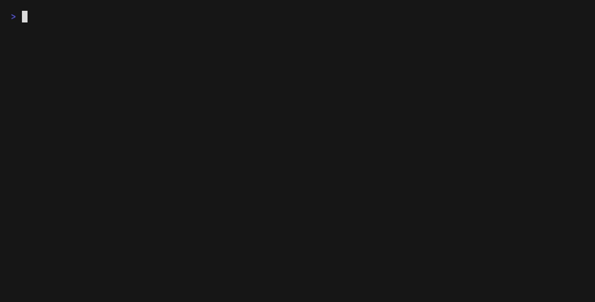

# Check the library

What to type to check the formatting and the citation accuracy of the library, and what
you will see. The [README](../../README.md#verify) describes every check;
`cdlbib verify --help` lists the options.

The output shown was recorded with `cdlbib 2.0.0` on October 2, 2026. Progress bars are
left out. Counts and dates will differ when you run the commands.

In [the terminal interface](terminal-interface.md) (`cdlbib tui`): `c` in the Library
view checks the selected entry. In the Check view (`F5`), `g` runs the completion offers
and then the check of the new or edited entries, `G` runs that check without the offers,
and `m` runs the format check on the whole library. The lines of a check appear in the
log at the bottom of the window.

## 1. Install

`cdlbib` needs Python 3.11 or later. From a checkout of the repository, the install
script installs it whatever the default Python is (the other ways are in the
[README](../../README.md#installation)):

```bash
sh install.sh
cdlbib --version
```

```text
cdlbib 2.0.0
```

No clone is needed. The first command that needs the library downloads it. Run
`cdlbib where` to find the copy to edit; [Installation](../../README.md#installation)
lists the locations and lookup order. If you already work in a clone, that copy is
used and never updated by the tool. For the remaining steps, change your terminal
directory to the folder printed by `cdlbib where`. This makes the relative paths
`cdl.bib` and `verification/baseline.jsonl.gz` refer to that library.

## 2. Check the formatting

After the first download, this check can run offline; an update-check failure prints a notice and uses the saved copy.

```bash
cdlbib verify --no-citations
```

```
loading cdl.bib...done
format: looks good!
looks good!
```

If an entry breaks a formatting rule, the problem is printed and the command exits with
`1`. For example, with the page range of `MannEtal11` reversed in a scratch copy:

```
loading cdl.bib...done
errors found: Exception: The following page numbers are ambiguous or incorrect: 
MannEtal11: (False, ['12897--12893', '12897--12893'])
```

Add `--verbose` for the full log.

## 3. Load the saved results

`verification/baseline.jsonl.gz` holds the saved verification result for every entry.
Load it into your local database (`.bibcheck/verification.sqlite3`, which git ignores),
then ask for the totals:

```bash
cdlbib crossref restore verification/baseline.jsonl.gz
cdlbib crossref status cdl.bib
```

```
Restored 6384 matching reviews
6384 entries: human_verified=36, metadata_verified=6348
```

`status` works offline. It exits with `0` when every entry is verified and `1` when some
are not.

## 4. Check formatting and accuracy together

The accuracy check contacts Crossref and other public services, which ask for a contact
address. Set yours, then run `verify` without `--no-citations`:

```bash
export CROSSREF_MAILTO='you@example.org'
cdlbib verify
```

`verify` offers completion for new or changed entries before checking the final
file. Use the same accept/edit/skip choices as `add`; `--no-complete` skips the
offers while retaining the format and citation checks. `verify --no-citations`
skips offers and works offline after the library has been downloaded. Autofix or
output-copy mode also skips offers; review the copy, then run normal `verify` on it.

With no new or edited entries:

```
loading cdl.bib...done
format: looks good!
citations: 0 of 0 new/edited entries verified; network requests: 0
library: 6384 entries: human_verified=36, metadata_verified=6348
looks good!
```

`verify` checks the accuracy of the entries that differ from the `master` version of
`cdl.bib` on GitHub. The `library:` line counts every entry.

## 5. Read an UNRESOLVED line

The output below comes from a scratch copy of the library in which the last page of
`MannEtal11` was changed from 12897 to 12899, so that the check fails:

```
loading cdl.bib...done
format: looks good!
Offline reassessment: 0 accepted
Second-source DOIs checked: 1/1; requests: 2
citations: 0 of 1 new/edited entries verified; network requests: 3
  UNRESOLVED MannEtal11 (needs_review): No unambiguous, fully supported metadata match; DOI-linked publisher/PubMed article coordinates conflict with or are missing from the citation
    closest source crossref 10.1073/pnas.1015174108: pages: missing evidence or mismatch
  Inspect with `cdlbib crossref review-packet KEY`; after checking the source, record a decision with `cdlbib crossref approve`.
library: 6384 entries: human_verified=36, metadata_verified=6347, needs_review=1
```

The command exits with `1`. Each `UNRESOLVED` line gives the citation key, the status in
parentheses, and the reason. The line under it gives the closest source record and the
fields that did not match: here, `pages`. The full record of each check is saved in
`.bibcheck/report.jsonl`.

After the entry is corrected to match the paper (here, the page is changed back), the same
command passes:

```
loading cdl.bib...done
format: looks good!
citations: 0 of 0 new/edited entries verified; network requests: 0
library: 6384 entries: human_verified=36, metadata_verified=6348
looks good!
```

To record a human review of an entry that the automatic check cannot confirm, see
[Human review](human-review.md).

## Screencast



Steps 2 and 3: `cdlbib verify --no-citations`, then `cdlbib crossref status cdl.bib`.
`scripts/make_screencasts.sh` records this GIF again into `docs/media/`, working on a
temporary copy of the library outside the repository.

## In the web interface

Start [the web interface](web-interface.md) with `cdlbib web` and open the **Check** view.
It has a box for citation keys (separated by spaces or commas) and three buttons:
"Check these entries", "Check the changed entries" and "Format check only". The lines of
the check appear under "Log" as they are produced, and the outcome under "Result". In the
**Library** view, "Check this entry" opens the **Check** view with that entry's key filled in.


