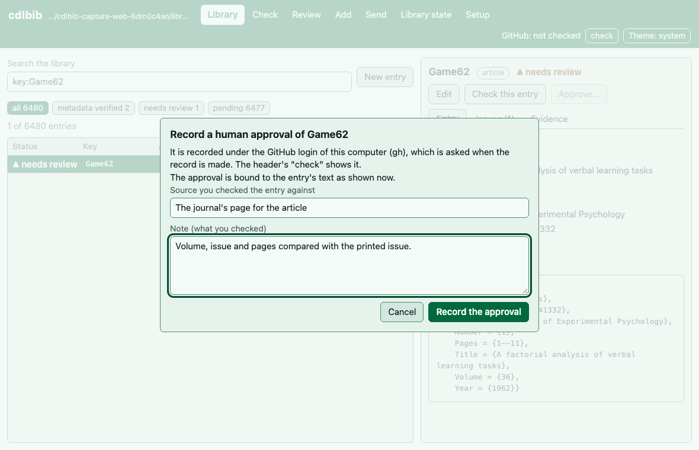

# Human review

How to record that you have checked an entry against its source, and how to withdraw
such a record. The reviewer's identity is the GitHub login of the GitHub CLI (`gh`) on
the computer; neither the command nor the web interface takes a typed name.

## Terminal interface

In [the terminal interface](terminal-interface.md) (`cdlbib tui`), press `F3` for the
Review view and select the entry. `a` opens the approval dialog, which names the GitHub
login the approval will be recorded under and has boxes for the source and the note;
`ctrl+s`, then `y`, records it. `v` revokes an approval in the same way, with a reason.
Both keys also work in the Library view (`F2`). The dialog has no box for a name.

## Command line

A human review is for an entry that you have checked against the source itself and that
the automatic check cannot confirm. The [README](../../README.md#human-review) describes when
it applies. `approve` records your GitHub login as the reviewer, so the
[GitHub CLI](https://cli.github.com) must be installed and logged in (`gh auth login`).

Export the entry, its fingerprint, and what the checker found:

```bash
cdlbib crossref review-packet MannEtal11 --output review-packet.json
```

```
review-packet.json
```

The file is JSON with the fields `key`, `fingerprint`, `entry`, `raw`, `verification` and
`instructions`. Copy the `fingerprint` value into the next command:

```bash
cdlbib crossref approve MannEtal11 \
  --fingerprint 'v2:1c1a69dd7e211570f273bd7690400f9b347bac79b3b285ec7f0e66b237d680a1' \
  --source 'URL or physical edition you checked' \
  --note 'Which fields you checked, and why the automatic check failed'
```

```
Human review recorded for MannEtal11; any source edit invalidates it.
```

`cdlbib crossref status cdl.bib` then counts the entry under `human_verified`:

```
6384 entries: human_verified=37, metadata_verified=6347
```

The example output in this section was recorded on October 2, 2026, on the scratch copy
from step 5 of [Check the library](checking.md#5-read-an-unresolved-line), before the entry
was corrected. An approval can be withdrawn with
`cdlbib crossref revoke MannEtal11 --reason 'Why'`, which prints:

```
Revoked MannEtal11 approval 3844e6da2f1b (fingerprint v2:1c1a69dd7e211570f273bd7690400f9b347bac79b3b285ec7f0e66b237d680a1); entry now needs_review
```

Revoking an approval that is already revoked changes nothing. Recorded on October 5,
2026, in a temporary copy of the library:

```bash
cdlbib crossref revoke Zoll90 --reason 'Recorded as a demonstration.'
```

```text
Zoll90: every matching approval is already revoked
```

## Web interface

The web-interface output in this section was recorded with `cdlbib 2.0.0` on October 5,
2026, in a temporary copy of the library. `@you` stands for the GitHub login.

Start [the web interface](web-interface.md) with `cdlbib web`.

The top of the page shows "GitHub: not checked" and a "check" button. The button asks
`gh` who is logged in, and the line becomes `GitHub: @you`.

To approve an entry, select it in the **Library** view and press "Approve…". The window
that opens says:

```text
Record a human approval of Zoll90
It is recorded under the GitHub login of this computer (gh), which is asked when the record is made. The header's "check" shows it.
The approval is bound to the entry's text as shown now.
```

It has two boxes, "Source you checked the entry against" and "Note (what you checked)",
and the buttons "Cancel" and "Record the approval".



After "Record the approval" the page says `Approval of Zoll90 recorded.` The entry's
status becomes "human verified", the line `Approved by @you.` appears under its key, and
its "Evidence" tab shows the record:

```text
Human approval
Reviewer
@you
Source
The journal's page for the article
Note
Volume, issue and pages compared with the journal's page.
```

For an approved entry the button is "Withdraw approval…". Its window asks for a reason and
has the buttons "Cancel" and "Withdraw the approval". After the withdrawal, the entry is
counted as `needs_review`: with the key `Zoll90` on a line of `keys.txt`, run from the
library folder,

```bash
cdlbib crossref status cdl.bib --keys keys.txt
```

```text
1 entries: needs_review=1
```

The **Review** view lists the entries that are not verified or approved. It has two
buttons. "Changed entries" lists those among the entries that differ from the `master`
version of `cdl.bib` on GitHub, which it downloads. "All entries" lists those in the whole
library, 100 to a page, with a search box that takes the same words as the library's. The view says at the top:

```text
A lookup, a proposal or a model reading is evidence. An approval is recorded only by the Approve action, under this computer's GitHub login.
```

Selecting an entry there shows what the sources say about it, with the same "Approve…"
button.

The "Issues" tab of an entry shows what the check found. Here the entry's volume
disagrees with the Crossref record:


