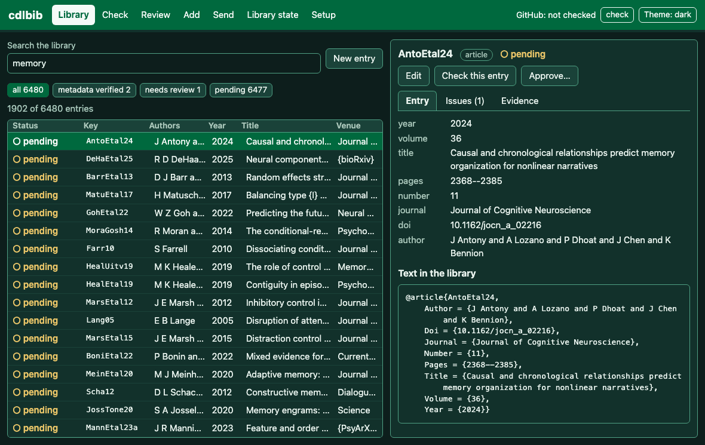

# Search the library

How to find entries in the library. The web interface has a search box; the same search
is available from Python as `cdlbib.api.search`. The command line has no search command.

The counts shown were recorded with `cdlbib 2.0.0` on October 5, 2026, in a temporary
copy of the bibliography with 6,481 entries, none of which had been checked there.

In [the terminal interface](terminal-interface.md) (`cdlbib tui`), press `/` in the
Library view and type; the table follows each letter. `f` limits the table to one status
at a time.

## What a search matches

- **Words.** Every word typed must be found, as a whole word or as part of one, in the
  entry's key, authors, title, venue, year or DOI. The words can be in any order and in
  different fields.
- **`field:word`.** A word after a field name is looked for in that field only. The field
  names are `key`, `author` (or `authors`), `title`, `venue` (or `journal`), `year`,
  `doi`, `type` and `status`. The venue is the first of the fields `journal`,
  `booktitle`, `publisher`, `school`, `institution` and `howpublished` that the entry
  has. The authors are the `author` field, or the `editor` field of an entry without one.
- **Quotation marks.** `"two words"` are found together, in that order. A field name can
  come before the quotation marks: `title:"context reinstatement"`.
- **Case, accents and braces.** Upper and lower case, accents, TeX accent commands and
  curly braces make no difference: `velez`, `vélez` and `V{\'e}lez` find the same entry.
- **Other text with a colon.** A name that is not one of the field names is searched for
  as typed: `colour:blue` looks for the text `colour:blue`.
- **Status.** A status filter keeps only the entries with that verification status:
  `metadata_verified`, `human_verified`, `needs_review`, `provider_error` or `pending`
  ([what the statuses mean](../../README.md#what-the-results-mean)).

|Search|Entries found|
|-|-|
|`memory`|1902|
|`"temporal lobe"`|139|
|`manning kahana 2011 oscillatory`|1|
|`author:manning year:2011`|2|
|`key:Zoll90`|1|
|`journal:nature 2021`|8|
|`doi:10.1073`|134|
|`title:"context reinstatement"`|3|
|`type:book status:pending`|240|
|`type:incollection hippocampus`|2|
|`colour:blue`|0|

## Web interface

Start [the web interface](web-interface.md) with `cdlbib web`. The **Library** view opens
first. Type in the box labelled "Search the library"; the list changes as you type, and
the line under the box gives the count, for example `1902 of 6481 entries`.

The buttons under the box filter by status. Each shows a status and the number of
entries with it; "all" removes the filter.

Selecting a row opens the entry: its fields and its text in the library on the "Entry"
tab, the verification and house-format findings on the "Issues" tab, and the source
records and lookups on the "Evidence" tab.


With the dark theme, after a search for `memory`:



## Python

```python
from cdlbib import api, workspace

ws = workspace.Workspace("/absolute/path/to/library")
for entry in api.search(ws, "author:manning year:2011"):
    print(entry.key, entry.year, entry.status, entry.title)
print(len(api.search(ws, "memory")), len(api.search(ws, "memory", status="human_verified")))
```

```text
Mann11 2011 pending Acquisition, storage, and retrieval in digital and biological brains
MannEtal11 2011 pending Oscillatory patterns in temporal lobe reveal context reinstatement during memory search
1902 0
```

`api.search` returns a list of entry summaries, in the order of the library. Each has
the attributes `key`, `type`, `authors`, `year`, `title`, `venue`, `doi`, `status` and
`issues`. `status` takes one status or several.
