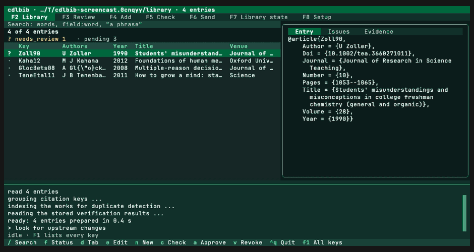
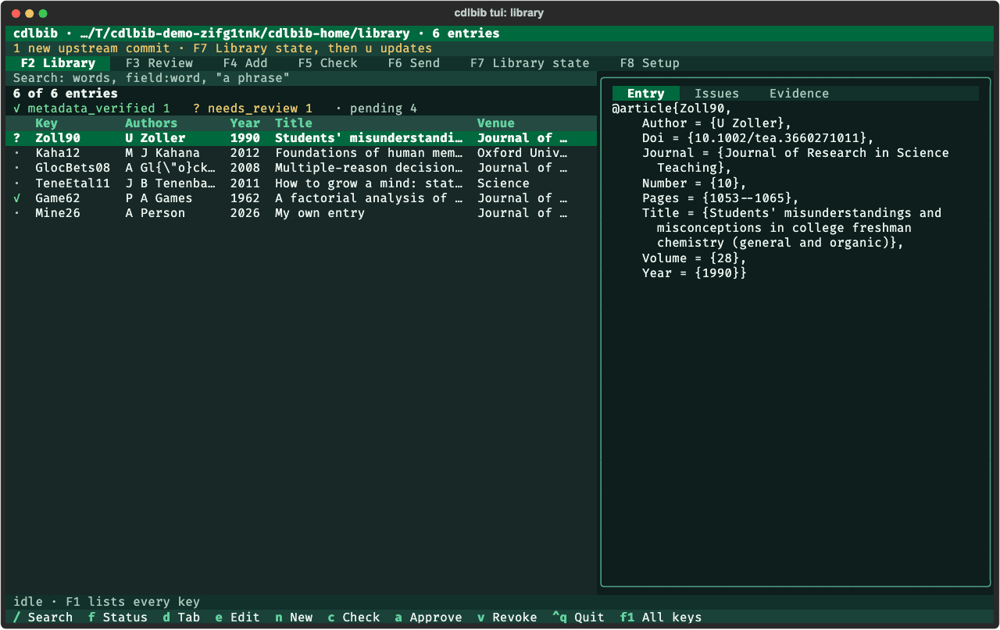
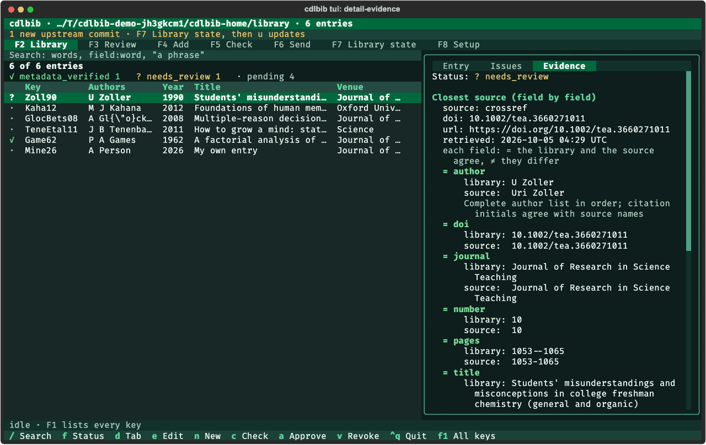
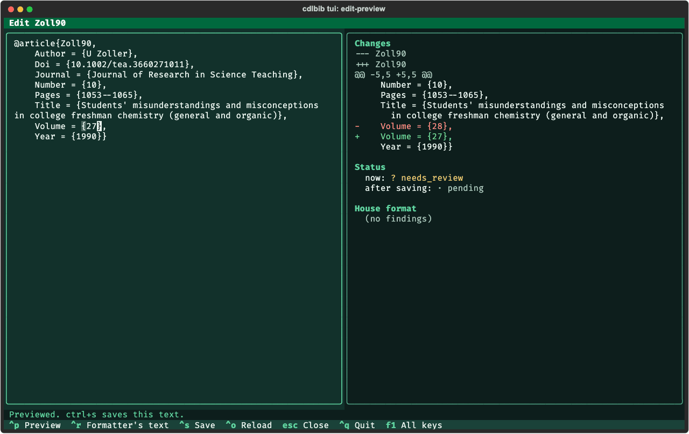
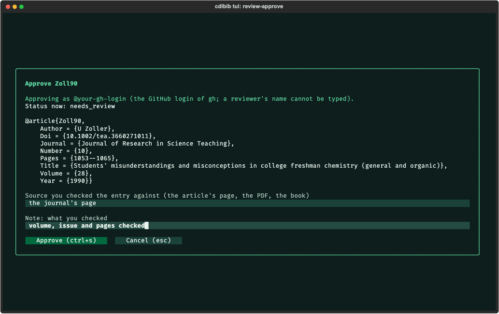
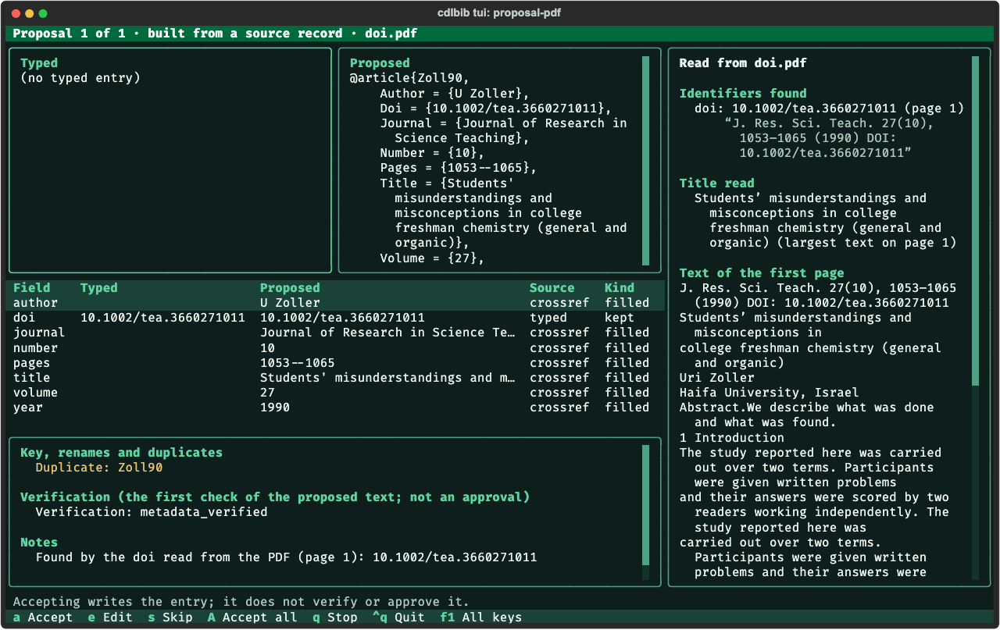
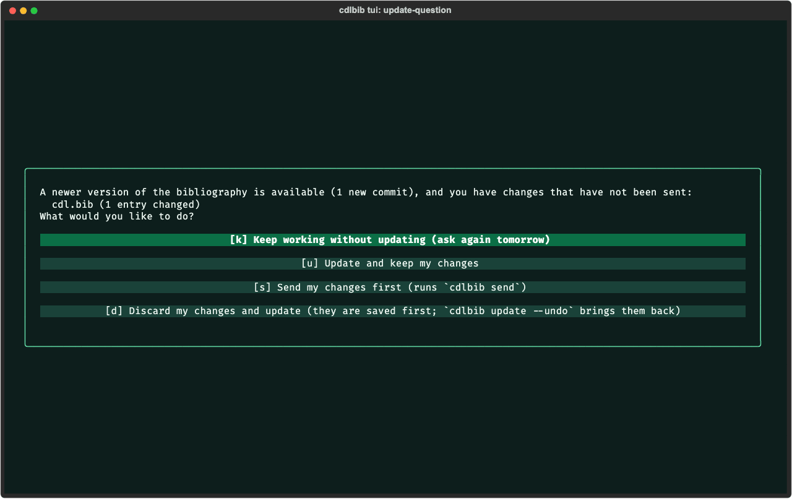

# The terminal interface

`cdlbib tui` opens a full-screen interface in the terminal for the library in use. It
offers what the commands offer: search, entry details, editing, checks, human review,
adding references, sending a pull request, the state of the library, and setup. Every
action is carried out by the same code as the commands.

- [Start it](#start-it)
- [The window](#the-window)
- [Keys](#keys)
- [Browse and search](#browse-and-search)
- [Issues and evidence](#issues-and-evidence)
- [Edit an entry](#edit-an-entry)
- [Check](#check)
- [Review: approve and revoke](#review-approve-and-revoke)
- [Add references](#add-references)
- [Send](#send)
- [Library state: update, backups, undo](#library-state-update-backups-undo)
- [Setup](#setup)
- [Themes](#themes)
- [What was not verified](#what-was-not-verified)

The screenshots were made by `scripts/capture_tui.py` (the interface's own screenshots,
drawn by headless Chromium), and the recording below by
`scripts/make_screencasts.sh docs/media tui`, with `cdlbib 2.0.0` on October 5, 2026, in
temporary libraries with saved lookup responses. Paths, counts and dates will differ when
you run the interface.



## Start it

```bash
cdlbib tui
```

The library is chosen as for every command
([Installation](../../README.md#installation)); `cdlbib --library PATH tui` names one.

The interface uses the package `textual`, which is the optional extra `tui`. When it is
not installed, the command prints

```text
installing textual (needed for: the terminal interface) ...
```

installs it, and then opens the interface. `cdlbib --ask tui` asks first; without a
terminal to ask at, `--ask` leaves it uninstalled and prints the manual installation
command. `python -m pip install "cdlbib[tui]"` installs it ahead of time.

The same applies inside the interface when an action needs another optional package
(`pypdf` to read a PDF): the log shows the `installing ...` line and the action is run
again. When the interface was started with
`--ask`, a yes/no question is shown first, for example
`Reading PDF files needs 'pypdf'. Install it now?`.

## The window



From top to bottom:

- the library's folder and the number of entries;
- a line that appears when there is something to act on, for example
  `1 new upstream commit · F7 Library state, then u updates`;
- the seven views: Library, Review, Add, Check, Send, Library state, Setup;
- the log, which shows the lines of the job that is running (`ctrl+l` hides or shows it);
- a line that names the running job (`working: ...`) or says `idle · F1 lists every key`;
- the keys of the part of the window the cursor is in, each followed by a short name, and
  `f1 All keys`.

Actions that read or change the library, ask a lookup service or run a check are jobs.
They run one at a time, in the order they were started. Typing a search does not wait for
a running job. Reading an entry's details does: until they are read, the right half shows
what the table knows of the entry (authors, year, title, venue, DOI, status) and the line
`The entry's text, issues and evidence load when the running job finishes: ...`. An entry
that was read before is shown at once.

## Keys

`F1` (or `?` when the cursor is not in a text box) shows these tables in the interface.

**Everywhere**

|Key|What it does|
|-|-|
|F1 or ?|this help (? when the cursor is not in a text box)|
|F2 … F8, or 1 … 7|Library, Review, Add, Check, Send, Library state, Setup|
|ctrl+t|switch between the dark and the light theme|
|ctrl+l|show or hide the log of the running job|
|ctrl+q, or q|quit (asks first while a job is running)|
|tab / shift+tab|move between the parts of a view|
|esc|leave a text box; close a dialog|

**Library**

|Key|What it does|
|-|-|
|/|type a search: words, field:word (key author title venue year doi type status), "a phrase"|
|f|show one status at a time (press again for the next; then all)|
|up / down / pgup / pgdn|move in the table; the entry's details follow|
|d|next detail tab: Entry, Issues, Evidence|
|e|edit the selected entry|
|n|type a new entry|
|c|check the selected entry now (format, then its citation)|
|a|approve the selected entry under your GitHub login|
|v|revoke the approval of the selected entry|

**Edit (an entry's text)**

|Key|What it does|
|-|-|
|ctrl+p|preview: the diff, the format findings, key change, status that is lost, entries affected|
|ctrl+r|put the formatter's corrected text into the editor|
|ctrl+s|save the previewed text (the editor takes no typing while it is saved)|
|ctrl+o|read the entry again from the file (asks before it replaces typed text)|
|esc|close (asks first when the text was changed)|

**Review**

|Key|What it does|
|-|-|
|t|the changed entries waiting for review, or every entry waiting|
|r|read the queue again|
|d|next detail tab|
|a|approve the selected entry (source and note; your GitHub login is shown)|
|v|revoke the selected entry's approval (reason)|
|e|edit the selected entry|
|c|check the selected entry now|

**Add**

|Key|What it does|
|-|-|
|esc, then left / right|from a text box to the row of tab names, and between Search, Identifier, PDF, Manual|
|enter or down|on the row of tab names: into the tab|
|ctrl+f|Search tab: find records for the title, authors and year typed (also enter in a box)|
|space|Search tab: mark or unmark the selected record|
|enter|Search tab: propose the marked records (or the selected one); Identifier tab: look them up|
|ctrl+o|PDF tab: choose the file from the folder tree|
|enter|PDF tab, in the path box: read the PDF|
|l|PDF tab: look up the PDF's source record|
|o|PDF tab: open the PDF in the system viewer (the interface itself shows its text)|
|m|PDF tab: read the PDF with a language model|
|t|PDF tab: type the entry in, the form filled with what was read|
|ctrl+s|Manual tab: draft the entry from the form|

**A proposal**

|Key|What it does|
|-|-|
|a|accept: write this entry|
|e|edit the proposed text, then check it again|
|s|skip this one|
|A|accept this and all remaining proposals that need no decision|
|r / k|a typed duplicate: remove it / keep both for the formatter|
|t / c|a proposal whose model evidence was not stored: try again / go on without it|
|q or esc|stop here; nothing more is written|

**Check**

|Key|What it does|
|-|-|
|c|check the entry selected in the Library view|
|g|completion offers for the changed entries, then their check|
|G|check the changed entries without the completion offers|
|m|run the format check on the whole library|

**Send**

|Key|What it does|
|-|-|
|s|send: completion offers first, then the checks, then the pull request from your fork|
|S|send without the completion offers (the checks still run)|
|r|read the library's state again (asks the upstream and GitHub)|

**Library state**

|Key|What it does|
|-|-|
|r|look for upstream changes now|
|u|update the library (asks what to do when there are unsent changes)|
|b|read the list of backups again|
|z|undo: put the library back as it was at the selected backup|
|p|store again the model evidence that entries still wait for|

**Setup**

|Key|What it does|
|-|-|
|c|check everything: asks gh who is logged in and reads the system keychain|
|l|link cdl.bib into your TeX tree|
|x|remove the link cdlbib made|
|b|write the frozen .bib of the paper named in the form|
|B|write the paper's compiled .bbl|

**Dialogs**

|Key|What it does|
|-|-|
|y / n|answer a yes/no question|
|the letter shown|choose that answer|
|ctrl+s|confirm a form|
|enter|next box of a form; in the last one, confirm|

A letter typed while the cursor is in a text box is text. Press `esc` to leave the box
before using a letter key.

## Browse and search

The Library view (`F2`) lists the entries in the order of the file. Before each key is
the mark of the entry's status; the line above the table gives the marks and the count
for each status, for example `✓ metadata_verified 1   ? needs_review 1   · pending 4`.

Press `/` and type. The table follows each letter. The search is the one described in
[Search the library](searching.md): words, `field:word`, and `"a phrase"`. `esc` or
`enter` returns to the table. `f` limits the table to one status; pressing it again moves
to the next status, and then back to all.

In a large library the table holds the first 400 matches, and more are added as the
cursor moves down. The line above the table says so.

## Issues and evidence

The right half of the Library view shows the selected entry. `d` moves through its three
tabs:

- **Entry**: the entry's text as it is in the file.
- **Issues**: the status, the issues the citation check recorded, its advisories, and the
  house-format findings with the value the formatter would write.
- **Evidence**: the closest source record field by field (`=` where the library and the
  source agree, `≠` where they differ, each with both values), the lookups that were
  made, evidence from a PDF or a model reading with its page and quotation, the human
  review if one is recorded, and a revoked approval with its reason.



## Edit an entry

1. Select the entry in the Library view and press `e`. `n` opens the same editor empty,
   for a new entry.
2. Change the text.
3. Press `ctrl+p`. The right half shows what saving would do: the diff, the house-format
   findings, a key change, the status now and after saving, a line such as
   `Saving loses the status human_verified: the edited text has not been verified or approved.`,
   and other entries whose status changes.
4. `ctrl+r` puts the formatter's text into the editor and previews it.
5. Press `ctrl+s`. Only a previewed text is saved: when the text was changed after the
   preview, `ctrl+s` shows the preview of the new text, and a second `ctrl+s` saves it.



While the save is under way the editor takes no typing. The log then shows `Saved: KEY`
and where the file as it was before is kept. A text that
cannot be saved (a key that is in use, a text that is not one entry, a `Force` field) is
listed under `Cannot be saved as it is`, and nothing is written.

A save replaces the entry as it was when the editor was opened. When something else
changed the entry in the file after that, the preview says so (`KEY was changed in the
file after it was opened here ...`), nothing is saved, and the typed text stays in the
editor. `ctrl+o` reads the entry again from the file; it asks before it replaces typed
text.

`esc` closes the editor. When the text was changed, it asks first.

## Check

- `c` in the Library or Review view checks the selected entry: the format check, then the
  citation check of that entry. The lines of the check appear in the log.
- The Check view (`F5`) shows the result: `Result: passed` or `Result: not passed`, the
  format findings, and each checked entry's status and issues.
- `g` in the Check view is the check of `cdlbib verify`: completion offers for the new or
  edited entries (see [A proposal](#a-proposal)), then their check. `G` leaves the offers
  out, as `--no-complete` does.
- `m` runs the format check on the whole library.

`g` and `G` compare the library with the GitHub copy of `cdl.bib`, so they need a network
connection.

## Review: approve and revoke

The Review view (`F3`) lists the new or edited entries that are not verified or
approved. `t` switches to every such entry in the library, which needs no network.

To approve the selected entry, press `a`. The interface asks `gh` who is logged in and
shows the dialog with that login:



In the picture, `@your-gh-login` stands in for the login. Type the source you checked the entry against and a note, then `ctrl+s` (or `enter` in
the last box). A question repeats the entry, the login, the source and the note; `y`
records the approval and `n` records nothing. There is no box for a reviewer's name.

`v` revokes the selected entry's approval in the same way, with a reason.

Without a GitHub login the interface shows `An approval is recorded under your GitHub
login, and none was found.` and how to log in (`gh auth login`), and records nothing.

`a` and `v` also work in the Library view. See [Human review](human-review.md) for what
is recorded.

## Add references

The Add view (`F4`) has four tabs. The cursor starts in the first box of the Search tab.
To change tabs, press `esc`, then `left` or `right`, then `enter`.

- **Search**: type a title, authors separated by `;`, a year, or several of these, and
  press `enter`. The records found are listed with their sources, and with the key of the
  library entry that is the same work when there is one. `enter` on a record looks it up
  and shows the proposal; `space` marks several first.
- **Identifier**: type one or several DOIs, PMIDs or arXiv identifiers, separated by
  spaces, commas or semicolons, and press `enter`.
- **PDF**: type the path of a PDF and press `enter`, or choose the file with `ctrl+o`.
  The view shows the text read from the PDF: the identifiers found in it, each with its
  page and the line it was read from, the title read, and the text of the first page.
  `l` looks up the source record. The terminal interface does not show the page itself:
  `o` opens the PDF in the system viewer, and the web interface shows the page. When no record is found, the interface offers the similar
  records it met, `m` to read the PDF with a language model, and `t` to type the entry
  in. `m` lists Dartmouth Chat first and then OpenAI, each with whether it is set up and
  how to set it up ([API keys](api-keys.md)).
- **Manual**: choose the entry type, fill the boxes, and press `ctrl+s`. After `t` in the
  PDF tab the form holds what was read from the PDF.

### A proposal

Every tab ends in the same view: what was typed beside what is proposed, each change with
its source, fields left unfilled and why, a new key or a renamed key, a duplicate, and
the issues. The changes are a table with one row for each field: what was typed, what is
proposed, its source, and whether it was filled, kept or changed. For a proposal that came
from a PDF, the text read from the PDF stays on the right.



`a` writes the entry, `e` opens the proposed text for editing and checks it again, `s`
skips it, `A` accepts it and the remaining proposals that need no decision, and `q` stops.
When a proposal cannot be accepted, the reasons are listed under
`Cannot be accepted as it stands:`. Accepting writes the entry; it does not verify or
approve it. When edited text could not be checked, `a`, `s` and `A` ask first whether to
open the text again or discard it.

An entry read by a model is written with the pages and quotations it was read from. When
those cannot be stored, the proposal stays on the screen with the reason; `t` tries again
and `c` goes on. Evidence that is still waiting is listed in the Library state view,
where `p` stores it.

See [Add references](adding-references.md) for what each lookup does.

## Send

The Send view (`F6`) lists the files a send would commit and the branch. Type a summary
if you want one (it becomes the pull request's title) and press `s`. After a yes/no
question the interface

1. offers completion for the new or edited entries, as `cdlbib send` does (`S` instead
   of `s` leaves this out);
2. runs the format check and the citation check of every new or edited entry;
3. commits `cdl.bib` and `verification/` on a branch, pushes it to your fork, and opens or
   updates the pull request.

The lines of the checks appear in the log. The view then shows `Sent.` with the pull
request's address, or `Not sent.` with the reason; a send that the checks refuse changes
nothing. See [Contribute a pull request](contributing.md).

## Library state: update, backups, undo

The Library state view (`F7`) shows the library's folder, how it was chosen, its branch,
the unsent changes, and whether the upstream has new commits. `r` asks the upstream now.

For the library that `cdlbib` downloads and manages:

- `u` updates it. When there are unsent changes, the interface shows the same question as
  `cdlbib update`, with one key for each answer:

  

- The table at the bottom lists the backups, newest first. Select one and press `z` to
  put the library back as it was then; the library as it is now is backed up first.

For a library chosen in another way the view says how it was chosen, and `u`, `b` and `z`
are not offered.

## Setup

The Setup view (`F8`) shows the state of the TeX link, what `cdlbib` found on the
computer, and the model services. Things that were not looked at are marked
`not checked`; `c` checks them (it asks `gh` who is logged in and reads the system
keychain). Each thing that is missing is listed with how to get it.

`l` links `cdl.bib` into your TeX tree and `x` removes the link. In the form below, name
a paper and press `b` to write its frozen `.bib`, or `B` to write its compiled `.bbl`.
For a paper that asks for LuaLaTeX, `B` shows the refusal and asks whether to compile it
with `lualatex`; it is run only after a yes.
See [LaTeX setup and export](latex-setup-and-export.md).

## Themes

The interface has a dark and a light theme; `ctrl+t` switches. It starts in the light
theme when the environment variable `COLORFGBG` names a light background (7 or 15), and
in the dark theme otherwise.

## What was not verified

- Creating a fork for the first time from the interface.
- The macOS Keychain dialog that may appear when `c` in the Setup view reads a stored key.
- A send from the interface that ends in a pull request. A send that the checks refuse
  was run.
- Completion offers before a check or a send, which need the GitHub copy of `cdl.bib`.
- `o` in the PDF tab (opening the system viewer).
