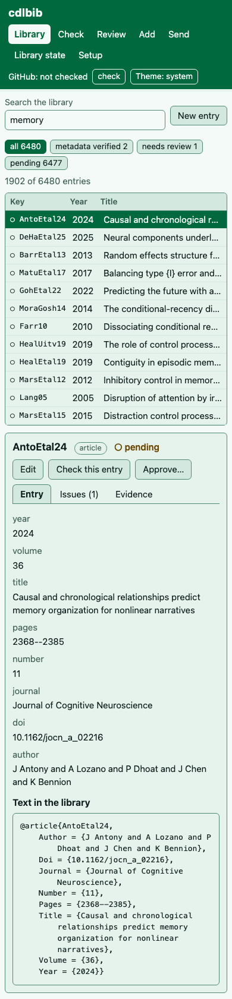

# The web interface

`cdlbib web` serves a page, on this computer only, for the library in use. The page
offers what the commands offer: search, entry details, editing, checks, human review,
adding references, sending a pull request, the state of the library, and setup.
`cdlbib web --help` lists the options.

- [Start it](#start-it)
- [The address and its token](#the-address-and-its-token)
- [The views](#the-views)
- [Files](#files)
- [Optional packages](#optional-packages)
- [Appearance](#appearance)

The output shown was recorded with `cdlbib 2.0.0` on October 5, 2026, with Chromium, in
temporary copies of the library chosen with `--library`. `~/demo` stands for the temporary
folder and `<TOKEN>` for the token.

[The terminal interface](terminal-interface.md) (`cdlbib tui`) offers the same views in
the terminal.

## Start it

```bash
cdlbib web
```

The command prints three lines, opens the address in your browser, and keeps running:

```text
cdlbib web: ~/demo/small/cdl.bib
open: http://127.0.0.1:8765/#token=<TOKEN>
This address works on this computer only, and until this command is stopped (Ctrl-C).
```

The first line names the bibliography file being served. The library is chosen as for
every command ([Installation](../../README.md#installation)); run `cdlbib where` to see
which one that is.

- `--no-open` prints the address without opening a browser.
- `--port NUMBER` chooses the port. Without it the system picks one. The lines above were
  printed by `cdlbib web --no-open --port 8765`.

Stop the command with Ctrl-C. It then exits with status `0`, and the address stops
working.

## The address and its token

The server listens on `127.0.0.1`, which other computers cannot reach. Each run makes a
new random token and prints it after `#token=` in the address. The page sends the token
with each of its requests for data. Such a request without the token is refused with
status `401` and the message:

```text
this request does not carry this run's token; open the address that `cdlbib web` printed
```

After the page has loaded, the browser's address bar shows the view instead of the token,
for example `http://127.0.0.1:8765/#/library`.

## The views

The bar at the top names the library's folder and has a button for each view.

|View|What it does|Tutorial|
|-|-|-|
|**Library**|Search box, status filters and the list of entries. Selecting an entry shows its fields and text, its issues and its evidence, with the buttons "Edit", "Check this entry" and "Approve…". "New entry" opens an empty edit box.|[Search](searching.md), [Modify](modifying-references.md)|
|**Check**|Checks the entries whose keys you type, the changed entries, or the format alone, with the log of the check.|[Check](checking.md)|
|**Review**|Lists the entries that are not verified or approved, for the changed entries or for all entries.|[Human review](human-review.md)|
|**Add**|Four tabs: "Search", "Identifiers", "PDF" and "Manual". Proposals appear under them.|[Add](adding-references.md)|
|**Send**|Shows what will be sent, offers completions, and has the "Check and send" button.|[Contribute](contributing.md)|
|**Library state**|Shows the folder, how it was chosen, and whether `cdlbib` manages it; asks the upstream for new commits; updates the managed library; has a "Backups and undo" panel.|[Managed-library updates](../../README.md#managed-library-updates)|
|**Setup**|Shows what `cdlbib` can use on this computer, links `cdl.bib` into the TeX tree, and makes a paper's own `.bib`.|[LaTeX setup and export](latex-setup-and-export.md), [API keys](api-keys.md)|

The right of the bar shows the GitHub login, with a "check" button that asks `gh` who is
logged in, and the theme button.

"Check this entry" opens the **Check** view with the entry's key filled in.

### Library state

For a library that `cdlbib` does not manage, the view reads:

```text
This library
Folder
~/demo/library
Chosen by
--library
Managed by cdlbib
no
```

and under "Backups and undo":

```text
cdlbib has not downloaded a library yet (it would be at ~/demo/data/library), so there are no backups and nothing to undo.
```

For the managed library, the view also shows the branch, the unsent changes and the new
upstream commits, with the buttons "Ask the upstream now", "Update the managed library"
and "Go to Send":


When a newer version is available and the library has unsent changes, "Update now" asks
the same question as the command line, with one button for each answer and "Cancel":


## Files

The page never takes the path of a file. A PDF, or a paper's `.tex`, `.aux` or `.bcf`
files, are chosen in the browser and uploaded to the `cdlbib web` program on the same
computer. The **Setup** view says of a paper's files:

```text
Upload the paper's .tex, .aux or .bcf file (several files when the paper is split); the entries it cites are written as a .bib to download. The files are kept only while cdlbib web runs.
```

Another kind of file is refused. For `main.bbl`:

```text
name: only .tex, .aux, .bcf files are taken
```

The exported `.bib` is a download. For a paper with two citations, after "Make the .bib":

```text
citations read from a fresh LaTeX run of the paper: 2 keys
2 entries from the library
Download cdl.bib
```

The web interface does not make a `.bbl`. The **Setup** view says:

```text
A compiled .bbl is not made here. In a terminal: cdlbib export PAPER --bbl (PAPER is the paper's main .tex file or its folder).
```

## Optional packages

When an action needs an optional package that is not installed, the page's log names the
package and it is installed, as on the command line. After `cdlbib --ask web`, the page
asks first. [Add references](adding-references.md#from-a-pdf) shows both.

## Appearance

The theme button cycles through "Theme: system", "Theme: light" and "Theme: dark". In a
narrow window the views are stacked, and the list shows the key, year and title:



The screenshots in these tutorials are made by `scripts/capture_web.py`, which runs the
web interface on a temporary library. The comment at the top of the script gives its
options.
